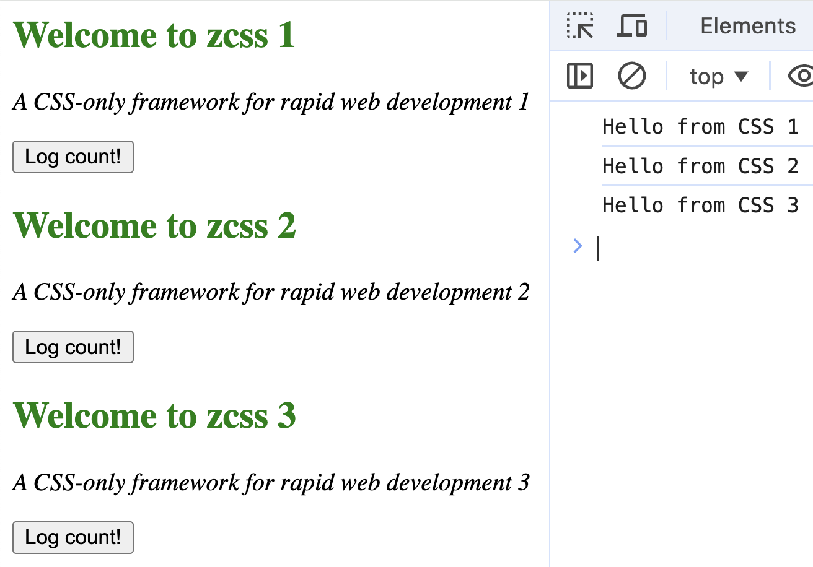

# ZCSS

A CSS-only framework for rapid web development

## How to Use

Just put it into index.html

```html
<script src="https://cdn.jsdelivr.net/gh/vsezol/zcss/zcss.js" defer></script>

<style zcss>
  repeat-3 {
    article > header {
      h1 {
        font-weight: bold;
        color: green;
        content: "Welcome to zcss $i";
      }

      p {
        font-style: italic;
        content: "A CSS-only framework for rapid web development $i";
      }
    }
  }
</style>
```

## Result will be


